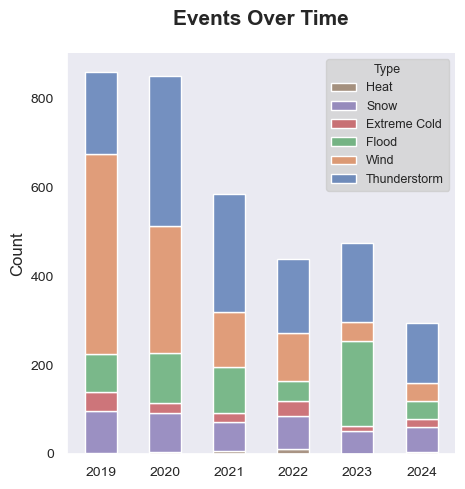
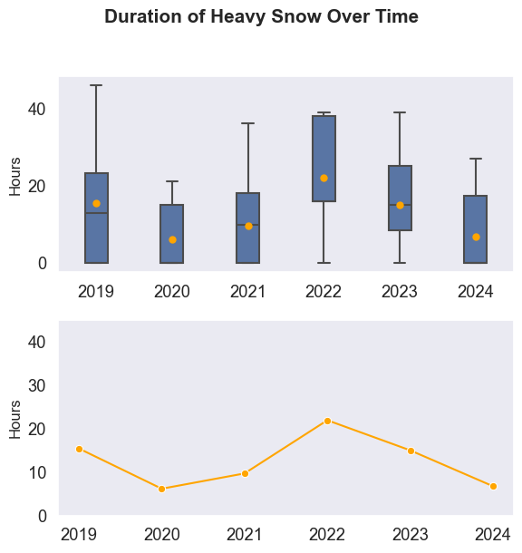
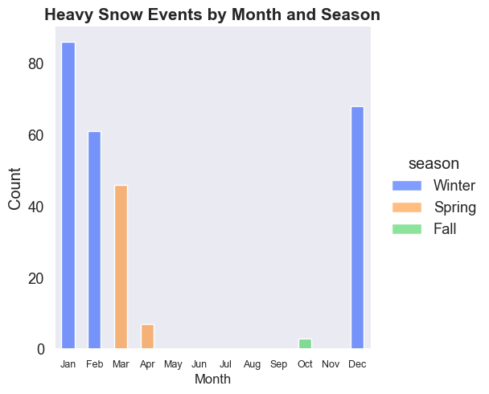

# Massachusetts Weather Analysis

Massachusetts Weather Analysis (MWA) is one of my weekend projects. It provides insights for weather events in Massachusetts based on data from 2019 to 2024 which is available for download from http://noaa.gov.

## Summary

1. **Data Overview**:
    - The dataset contains weather event data for Massachusetts, with 3503 entries and 49 columns.
    - The data includes information such as event type, location, date, time, magnitude, and narrative descriptions.

2. **Event Types**:
    - The events are categorized into six main groups: Wind, Flood, Thunderstorm, Extreme Cold, Snow, and Heat.
    - Thunderstorm events are the most common, followed by Wind and Flood events.

    

3. **Time Standardization and Feature Creation**:
    - The time columns have been standardized and new features such as month, year, day, and duration have been created.
    - Events have been grouped into categories based on their type.

4. **Location Grouping**:
    - Locations have been standardized and grouped to remove inconsistencies and typos.

5. **Seasonal Grouping**:
    - Months have been grouped into seasons: Winter, Spring, Summer, and Fall.

6. **Event Trends**:
    - The total number of events has decreased by about 50%, with a significant reduction in wind-related events.
    - Flood events increased in 2023 but decreased in 2024.

    

7. **Event Distribution by Location**:
    - Worcester, Berkshire, and Middlesex counties have the highest number of events.
    - Berkshire county experiences a wide range of extreme weather conditions.

    

8. **Snow Events**:
    - Snow events are prevalent across all locations and seasons, with Nantucket being an exception with fewer snow events.
    - The duration of heavy snow events has increased slightly over the years.
    - Heavy snow events typically start in winter, most often in January, but can also occur in spring and occasionally in fall.

    

    

    

    

These insights provide a comprehensive understanding of the weather events in Massachusetts, highlighting trends, seasonal patterns, and regional differences.

## Feedback

Feedbacks are welcome and much appreciated. Please email me at [hoa.letp@gmail.com](mailto:hoa.letp@example.com).

---
